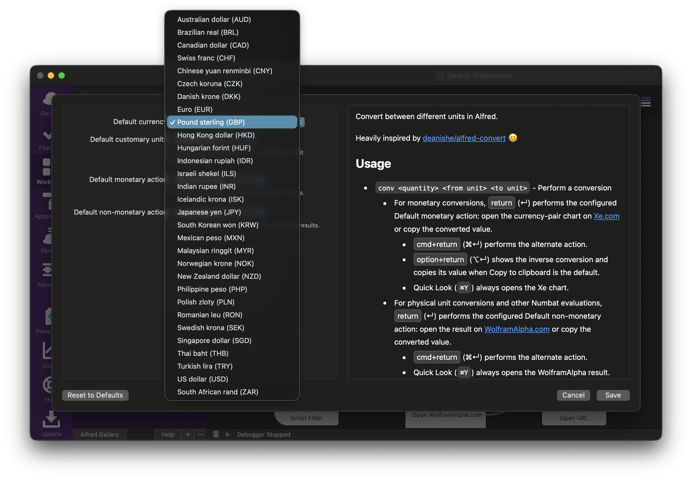

# Alfred Convert Workflow


Convert between different units in Alfred.

Heavily inspired by [deanishe/alfred-convert](https://github.com/deanishe/alfred-convert) 😊


## Installation

1. [Download the latest version](https://github.com/techouse/alfred-convert/releases/latest)
2. Install the workflow by double-clicking the `.alfredworkflow` file
3. You can add the workflow to a category, then click "Import" to finish importing. You'll now see the workflow listed
   in the left sidebar of your Workflows preferences pane.

## Usage

- `conv <quantity> <from unit> <to unit>` - Perform a conversion
    - For monetary conversions, <kbd>return</kbd> (↵) performs the configured Default monetary action: open the currency-pair chart on [Xe.com](http://www.xe.com) or copy the converted value.
      - <kbd>cmd+return</kbd> (⌘↵) performs the alternate action.
      - <kbd>option+return</kbd> (⌥↵) shows the inverse conversion and copies its value when Copy to clipboard is the default.
      - Quick Look (`⌘Y`) always opens the Xe chart.
    - For physical unit conversions and other Numbat evaluations, <kbd>return</kbd> (↵) performs the configured Default non-monetary action: open the result on [WolframAlpha.com](https://www.wolframalpha.com) or copy the converted value.
      - <kbd>cmd+return</kbd> (⌘↵) performs the alternate action.
      - Quick Look (`⌘Y`) always opens the WolframAlpha result.
- `conv money` - View a list of all the supported currencies
    - Rate-backed rows use the same configured Default monetary action and <kbd>cmd+return</kbd> (⌘↵) alternate action.
      - <kbd>option+return</kbd> (⌥↵) shows the inverse rate and copies it when Copy to clipboard is the default.
      - Quick Look (`⌘Y`) always opens the Xe chart.
- `conv units` - View a list of all the supported physical units
    - When selecting a certain unit and pressing <kbd>return</kbd> (↵) that unit's symbol will get copied to the clipboard.

### Default currency

In order to set a default currency, you can set it in the Workflow Configuration.



Valid values are the [ISO 4217](https://en.wikipedia.org/wiki/ISO_4217) currency codes: AUD, BRL, CAD, CHF, CNY, CZK, 
DKK, EUR, GBP, HKD, HUF, IDR, ILS, INR, ISK, JPY, KRW, MXN, MYR, NOK, NZD, PHP, PLN, RON, RUB, SEK, SGD, THB, TRY, USD, ZAR.

### Default actions

The Workflow Configuration provides separate Default monetary action and Default non-monetary action preferences. `Open website` remains the default for both; choose `Copy to clipboard` to copy only the converted value instead. <kbd>cmd+return</kbd> always performs the alternate action.

### Notes

- All [the reference exchange rates are from the ECB](https://www.ecb.europa.eu/stats/policy_and_exchange_rates/euro_reference_exchange_rates/html/index.en.html).
  The reference rates are usually updated around 16:00 CET on every working day, except
  on [TARGET closing days](https://www.ecb.europa.eu/home/contacts/working-hours/html/index.en.html).

- Non-monetary conversions are evaluated by [Numbat](https://numbat.dev/). Native Numbat expressions such as `2in to cm`, arithmetic, constants, and compound units are supported alongside the workflow's historical shorthand.

- The displayed emoji images are from [joypixels/emoji-assets](https://github.com/joypixels/emoji-assets).

## Development

The workflow is an unpublished Rust 2024 crate and requires Rust 1.88 or newer.
Install the locked license generator before running the full local checks:

```shell
cargo install cargo-about --locked --features cli
make ci
```

`make build-release` creates a native development build. `make package` builds
both Apple Silicon and Intel slices and creates a universal `.alfredworkflow`
archive under `build/`.
