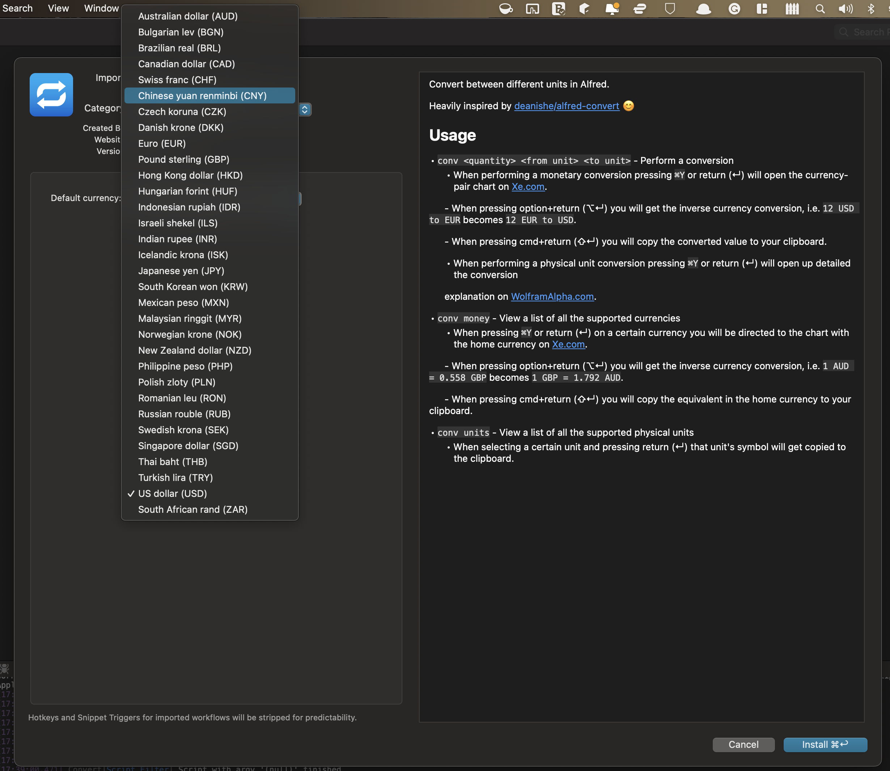

# Alfred Convert Workflow

Convert between different units in Alfred.

Heavily inspired by [deanishe/alfred-convert](https://github.com/deanishe/alfred-convert) 😊

## Installation

1. [Download the latest version](https://github.com/techouse/alfred-convert/releases/latest)
2. Install the workflow by double-clicking the `.alfredworkflow` file
3. You can add the workflow to a category, then click "Import" to finish importing. You'll now see the workflow listed
   in the left sidebar of your Workflows preferences pane.

## Usage

- `conv <quantity> <from unit> <to unit>` - Perform a conversion
    - When performing a monetary conversion pressing `⌘Y` or <kbd>return</kbd> (↵) will open the currency-pair chart on [Xe.com](http://www.xe.com).
      - When pressing <kbd>option+return</kbd> (⌥↵) you will get the inverse currency conversion, i.e. `12 USD to EUR` becomes `12 EUR to USD`.
      - When pressing <kbd>cmd+return</kbd> (⌘↵) you will copy the converted value to your clipboard.
    - When performing a physical unit conversion pressing `⌘Y` or <kbd>return</kbd> (↵) will open up detailed the conversion
      explanation on [WolframAlpha.com](https://www.wolframalpha.com).
- `conv money` - View a list of all the supported currencies
    - When pressing `⌘Y` or <kbd>return</kbd> (↵) on a certain currency you will be directed to the chart with the home currency on [Xe.com](http://www.xe.com).
      - When pressing <kbd>option+return</kbd> (⌥↵) you will get the inverse currency conversion, i.e. `1 AUD = 0.558 GBP` becomes `1 GBP = 1.792 AUD`.
      - When pressing <kbd>cmd+return</kbd> (⌘↵) you will copy the equivalent in the home currency to your clipboard.
- `conv units` - View a list of all the supported physical units
    - When selecting a certain unit and pressing <kbd>return</kbd> (↵) that unit's symbol will get copied to the clipboard.

### Default currency

In order to set a default currency, you can set it in the Workflow Configuration.

Valid values are the [ISO 4217](https://en.wikipedia.org/wiki/ISO_4217) currency codes: AUD, BGN, BRL, CAD, CHF, CNY, CZK, 
DKK, EUR, GBP, HKD, HUF, IDR, ILS, INR, ISK, JPY, KRW, MXN, MYR, NOK, NZD, PHP, PLN, RON, RUB, SEK, SGD, THB, TRY, USD, ZAR.

### Notes

- All [the reference exchange rates are from the ECB](https://www.ecb.europa.eu/stats/policy_and_exchange_rates/euro_reference_exchange_rates/html/index.en.html).
  The reference rates are usually updated around 16:00 CET on every working day, except
  on [TARGET closing days](https://www.ecb.europa.eu/home/contacts/working-hours/html/index.en.html).

- All non-monetary conversions performed using [ferraridamiano/units_converter](https://github.com/ferraridamiano/units_converter). 

- The displayed emoji images are from [joypixels/emoji-assets](https://github.com/joypixels/emoji-assets).